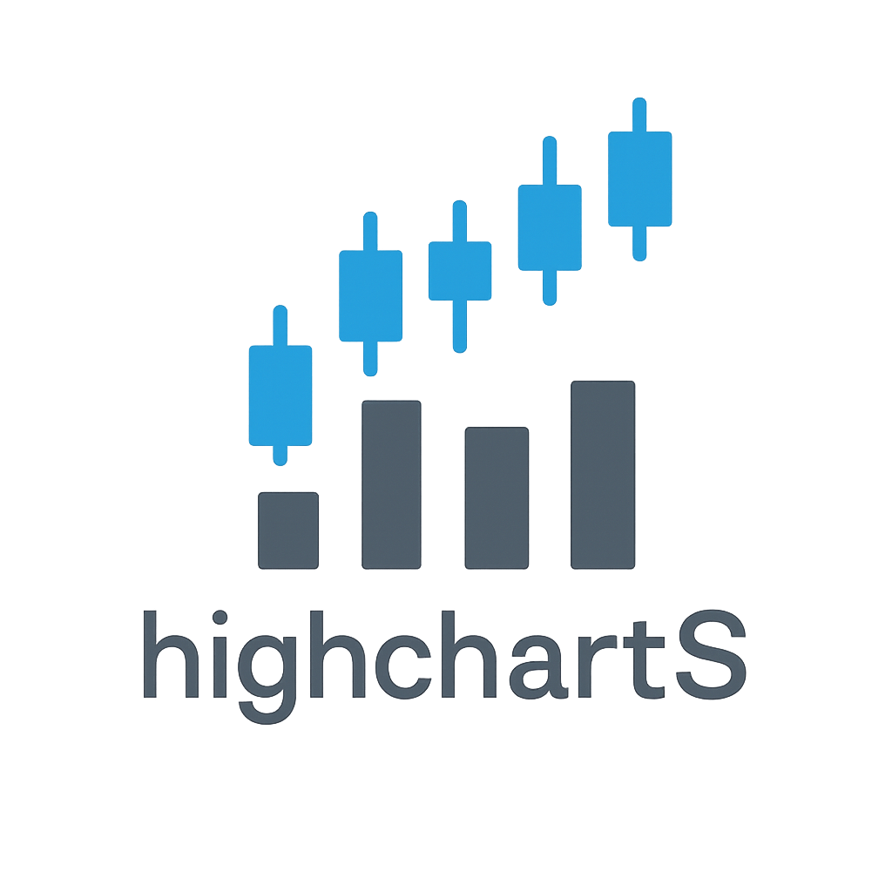

# highchartS 

Custom **Highstock htmlwidget for R** (no dependency on `highcharter`).  
With this package you can render interactive Highcharts/Highstock graphs in R, RMarkdown and Shiny.  

⚠️ **Important:** This package bundles [Highcharts/Highstock JS](https://www.highcharts.com/) files.  
Highcharts is **free for non-commercial use** (personal, academic, educational, open-source).  
For **commercial use**, you must obtain a license from [Highsoft AS](https://shop.highcharts.com/).  

---

## Installation

```
# install.packages("remotes")
remotes::install_github("SerkanAlbayrak/highchartS")
```

## Example

```
library(highchartS)
library(quantmod)

# get stock data
getSymbols("AAPL", src = "yahoo", from = "2020-01-01")

# prepare series
s_price <- as_hc_series(Cl(AAPL),  name = "AAPL Close")
s_vol   <- as_hc_series(Vo(AAPL),  name = "Volume")

# configure y-axes
yaxes <- list(
  list(title = list(text = "Price"),  height = "65%", lineWidth = 2),
  list(title = list(text = "Volume"), top    = "70%", height = "30%",
       offset = 0, lineWidth = 2)
)

# render chart
highchartS(
  series = list(
    s_price,
    modifyList(s_vol, list(type="column", yAxis=1))
  ),
  title = "AAPL - highchartS (local Highstock widget)",
  yAxis = yaxes,
  rangeSelector = TRUE,
  height = 600
)
```
This will render an interactive stock chart with **price** and **volume** panels, using locally bundled Highstock JavaScript (no CDN required).

---

## Features

- Pure **htmlwidget** implementation (no `highcharter` dependency)  
- Local distribution of Highcharts/Highstock JS (works offline)  
- `as_hc_series()` and `as_hc_ohlc()` helpers for xts/data.frame  
- Multiple y-axes (price + volume, indicators, etc.)  
- Compatible with **RMarkdown** and **Shiny**  

---

## License

- **R wrapper code:** MIT License © Raif Serkan Albayrak  
- **Highcharts/Highstock JavaScript files:** © Highsoft AS  
  - Free for **non-commercial** and academic/educational use  
  - Commercial users must obtain a [valid license](https://www.highcharts.com/license)  

See LICENSE file for details.

